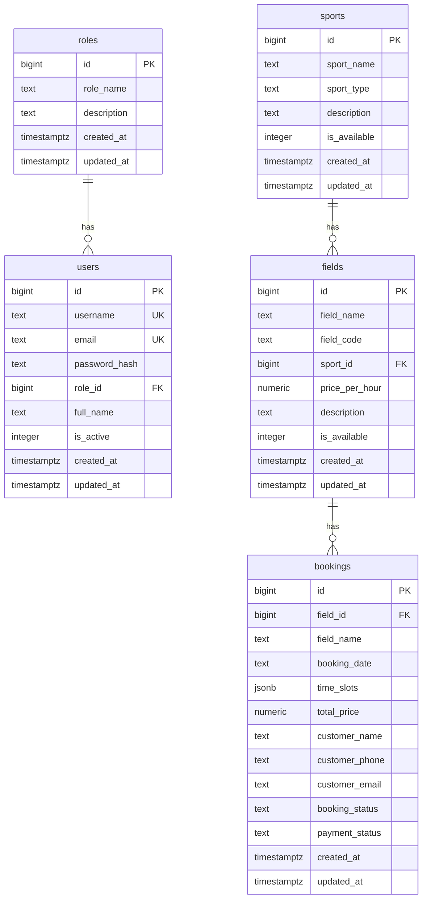
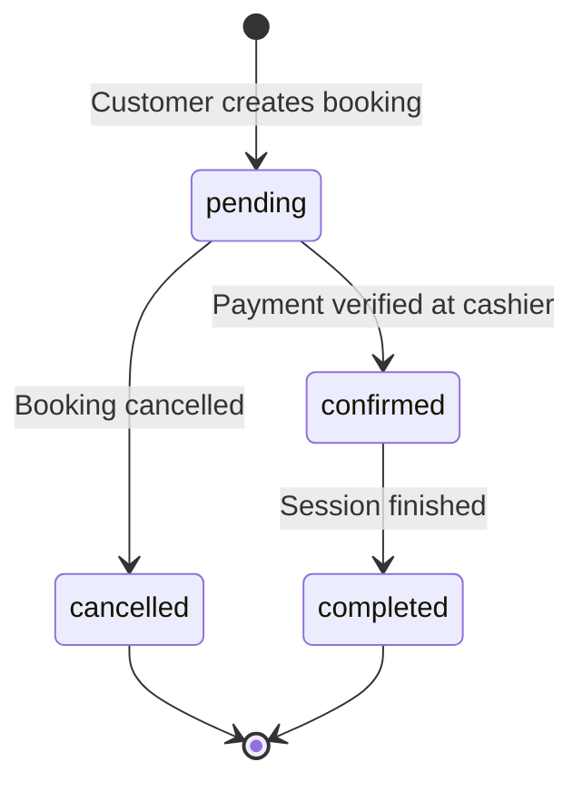

# Sport Arena - Product Specification

## 1. Product Overview

**Sport Arena** is a comprehensive sports venue rental and management platform designed for multi-sport facilities in Tangerang Selatan, Indonesia. The platform enables customers to book sports courts online while providing venue operators with powerful administrative tools for managing bookings, processing payments, and analyzing business performance.

### Vision Statement
"The Best Place for Sports, Fun and Community in Tangerang Selatan"

### Key Value Propositions
- **Play** – Premium quality sports venues
- **Train** – Professional-grade facilities
- **Connect** – Community-building through sports

---

## 2. Target Users

| User Type | Description | Primary Goals |
|-----------|-------------|---------------|
| **Customers** | Sports enthusiasts seeking venue rentals | Book courts, check availability, view pricing |
| **Admin** | Venue staff managing day-to-day operations | Manage sports, fields, and basic administration |
| **Owner** | Business owner/manager | Full dashboard access, analytics, revenue tracking |
| **Cashier** | Point-of-sale staff | Process payments, handle walk-in bookings, sell F&B |

---

## 3. Features & Functionality

### 3.1 Customer-Facing Features

#### Landing Page
- Hero section with animated backgrounds and 3D parallax effects
- Statistics display (15+ venues, 2k+ community, 24/7 open, 4.9 rating)
- Sports showcase with available venue categories
- Events section for promotions and tournaments
- Testimonials carousel
- Contact information with WhatsApp integration

#### Online Booking System
- **Sport Selection**: Choose from available sports categories
- **Field Selection**: View available courts with hourly pricing
- **Date Selection**: Calendar picker (future dates only)
- **Availability Checking**: Real-time slot availability via API
- **Time Slot Selection**: 
  - Hourly slots from 06:00 to 22:00
  - Visual indicators for booked, available, and selected slots
  - Multi-slot selection support
- **Booking Summary**: Field name, date, duration, total price calculation
- **Customer Information**: Name and WhatsApp number collection

#### AI Assistant
- Conversational support for booking inquiries
- Information about venues and pricing
- General assistance and FAQs

---

### 3.2 Administrative Features

#### Dashboard (Owner Only)
- **Revenue Overview**:
  - Total incoming revenue (confirmed/completed bookings)
  - Lost revenue (cancelled bookings)
  - Pending payments tracking
- **Data Visualization**:
  - Bar charts showing booking trends by sport over 3 months
  - Pie chart displaying revenue distribution by sport type
- **Filtering Options**:
  - Time period: Today, This Week, This Month, This Year, All Time
  - Sport type filter
- **Recent Transactions Table**:
  - Booking ID, customer info, field, date, amount, status
  - Status badges: confirmed, pending, cancelled, completed
- **Pending Payments Tab**:
  - Quick view of bookings awaiting payment verification

#### Sports Management (Admin/Owner)
- Add, edit, and delete sport categories
- Set sport availability status
- Fields: sport name, sport type, description

#### Field Management (Admin/Owner)
- CRUD operations for venue fields
- Configuration options:
  - Field name and code
  - Associated sport category
  - Price per hour (in IDR)
  - Description
  - Availability toggle
- Image upload support

---

### 3.3 Cashier (POS) System

#### Multi-Tab Interface
- **Booking Pending**: Process pending venue bookings
- **Makanan (Food)**: Add food items to cart
- **Minuman (Beverages)**: Add drink items to cart

#### Cart Management
- Add items from any tab to unified cart
- Edit quantities for F&B items
- Remove items from cart
- Real-time total calculation

#### Payment Processing
- Cash payment input with thousand separator formatting
- Automatic change calculation
- Payment validation (reject if insufficient)
- Invoice generation with unique number
- Automatic booking status update on payment

#### Search Functionality
- Search pending bookings by customer name or phone
- Search inventory by item name

---

## 4. Technical Architecture

### Technology Stack

| Layer | Technology |
|-------|------------|
| **Frontend Framework** | Next.js 13 (App Router) |
| **UI Library** | React 18 |
| **Styling** | Tailwind CSS 3.3 + Tailwind Animate |
| **Component Library** | Radix UI primitives + shadcn/ui |
| **Charts** | Recharts |
| **Forms** | React Hook Form + Zod validation |
| **Database** | Supabase (PostgreSQL) |
| **Authentication** | JWT-based with bcrypt password hashing |
| **Deployment** | Netlify (with plugin support) |

### Database Schema

### API Endpoints

| Endpoint | Methods | Description |
|----------|---------|-------------|
| `/api/auth/login` | POST | User authentication |
| `/api/auth/logout` | POST | Session termination |
| `/api/auth/me` | GET | Get current user |
| `/api/sports` | GET, POST | Sports CRUD |
| `/api/sports/[id]` | GET, PUT, DELETE | Single sport operations |
| `/api/fields` | GET, POST | Fields CRUD |
| `/api/fields/[id]` | GET, PUT, DELETE | Single field operations |
| `/api/booking` | GET, POST | Bookings CRUD |
| `/api/booking/check-availability` | GET | Check time slot availability |
| `/api/bookings/pending` | GET | Get pending bookings for cashier |
| `/api/pemasukan` | POST | Record payment/income |
| `/api/barang` | GET | Get inventory items (F&B) |
| `/api/ai-chat` | POST | AI assistant endpoint |

---

## 5. User Roles & Permissions

| Feature | Customer | Cashier | Admin | Owner |
|---------|----------|---------|-------|-------|
| View landing page | ✅ | ✅ | ✅ | ✅ |
| Book venue | ✅ | ✅ | ✅ | ✅ |
| Use AI Assistant | ✅ | ✅ | ✅ | ✅ |
| Access Cashier | ❌ | ✅ | ✅ | ✅ |
| Manage Fields | ❌ | ❌ | ✅ | ✅ |
| Manage Sports | ❌ | ❌ | ✅ | ✅ |
| View Dashboard | ❌ | ❌ | ❌ | ✅ |

---

## 6. Supported Sports & Pricing

| Sport | Type | Sample Fields | Price Range (IDR/hour) |
|-------|------|---------------|------------------------|
| **Futsal** | futsal | 3 fields (A, B, C Premium) | 150,000 - 180,000 |
| **Mini Soccer** | mini-soccer | 3 fields (AA, BB, CC Premium) | 200,000 - 250,000 |
| **Basketball** | basketball | 3 courts (1, 2, 3 Indoor) | 120,000 - 150,000 |
| **Badminton** | badminton | 4 courts (1, 2, 3, 4 Premium) | 80,000 - 100,000 |
| **Padel** | padel | Available | Varies |
| **Tennis** | tenis | Currently unavailable | - |

---

## 7. Design System

### Color Palette
- **Background**: `#333333` (dark gray)
- **Card Background**: `#404040` (medium gray)
- **Primary Accent**: Blue (`blue-500/600`)
- **Secondary Accent**: Red (`red-500/600`)
- **Success**: Emerald (`emerald-500`)
- **Warning**: Amber (`amber-500`)
- **Danger**: Rose (`rose-500`)

### Design Characteristics
- Dark theme with gradient accents
- Glassmorphism effects (`backdrop-blur`)
- Animated gradient backgrounds
- Rounded corners (2xl radius)
- Subtle border highlights (`border-white/10`)
- Hover animations with scale transforms

---

## 8. Booking Status Flow

---

## 9. Contact & Support

- **WhatsApp**: +62 812-3456-7890
- **Email**: admin@sportarena.com / owner@sportarena.com
- **Operating Hours**: 24/7

---

## 10. Future Considerations

> [!NOTE]
> The following are potential enhancements identified from the current codebase:

1. **Online Payment Integration** - Currently only cash payments supported
2. **Email Notifications** - Booking confirmations and reminders
3. **Membership System** - Loyalty programs and discounts
4. **Mobile App** - Native mobile experience
5. **Recurring Bookings** - Weekly/monthly booking schedules
6. **Multi-venue Support** - Expand to multiple locations
7. **Inventory Management** - Full F&B stock tracking
8. **Staff Scheduling** - Employee shift management
